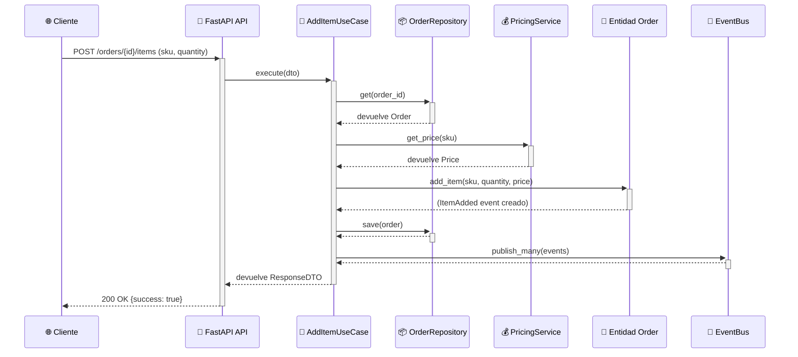

# 🛒 Orders Microservice - Clean Architecture & DDD

Un microservicio completo para la gestión de pedidos que aplica los principios de **Clean Architecture** y **Domain-Driven Design (DDD)**. El proyecto incluye una API REST con FastAPI, un frontend web funcional y un conjunto completo de tests que validan cada capa de la arquitectura.

[](https://python.org)
[](#-testing)
[](#)

## ✨ Funcionalidades Principales

- **API REST Completa**: Endpoints para crear órdenes, añadir artículos, y consultar órdenes.
- **Frontend Elegante**: Interfaz web responsive y profesional para interactuar con la API.
- **Domain-Driven Design**: Modelado del dominio con Value Objects, Entities y Domain Events.
- **Arquitectura Dirigida por Eventos**: Los eventos de dominio (ej. `OrderCreated`) desacoplan la lógica.
- **Inyección de Dependencias**: Un `Container` se encarga de construir y proveer las dependencias.
- **Tests Unitarios y de Integración**: 36 tests que cubren todas las capas del microservicio.
- **Logging Profesional**: Sistema de logging configurable con rotación de ficheros para un seguimiento detallado.

## 🏗️ Arquitectura del Proyecto

El proyecto sigue estrictamente los principios de **Clean Architecture**, asegurando que la lógica de negocio (dominio) sea independiente de frameworks y detalles de implementación.

```mermaid
graph TD
    subgraph Presentation [Capa de Presentación]
        A[FastAPI Endpoints]
    end
    subgraph Application [Capa de Aplicación]
        B[Casos de Uso]
        C[DTOs]
        D[Ports (Interfaces)]
    end
    subgraph Domain [Capa de Dominio]
        E[Entidades]
        F[Value Objects]
        G[Eventos de Dominio]
    end
    subgraph Infrastructure [Capa de Infraestructura]
        H[Repositorios en Memoria]
        I[Servicios Externos]
        J[Bus de Eventos]
    end

    A --> B
    B --> D
    B --> E
    J -- Implementa --> D
    H -- Implementa --> D
    I -- Implementa --> D
    E --> F
    E --> G

    style Domain fill:#f9f,stroke:#333,stroke-width:2px
    style Application fill:#ccf,stroke:#333,stroke-width:2px
    style Presentation fill:#cfc,stroke:#333,stroke-width:2px
    style Infrastructure fill:#fcf,stroke:#333,stroke-width:2px
```

### Flujo de un Caso de Uso: `AddItemToOrder`

Este diagrama de secuencia ilustra cómo las capas colaboran para añadir un artículo a una orden, respetando la regla de dependencia.



## 📁 Estructura de Ficheros

La organización de los ficheros refleja las capas de la arquitectura:

```
orders_ms/
├── domain/            # 🎯 Lógica de negocio pura (Entidades, Value Objects, Eventos).
├── application/       # 💼 Orquestación (Casos de Uso, DTOs, Puertos/Interfaces).
├── infrastructure/    # 🔧 Implementaciones concretas (Repositorios, Servicios, Bus de Eventos).
├── static/            # 🎨 Frontend (HTML, CSS, JS).
├── tests/             # 🧪 Tests por capas (domain, application, infrastructure, http).
├── main.py            # 🚀 Capa de Presentación (API con FastAPI).
├── container.py       # 📦 Inyección de Dependencias (Composition Root).
├── scripts/dev_ms.py  # 🛠️ Script de desarrollo y testing.
└── requirements.txt   # 📄 Dependencias del proyecto.
```

## 🚀 Cómo Empezar

### 1. Configuración del Entorno

```bash
# 1. Navega al directorio del microservicio
cd orders_ms

# 2. (Recomendado) Crea y activa un entorno virtual
python -m venv .venv
source .venv/bin/activate

# 3. Instala las dependencias
pip install -r requirements.txt
```

### 2. Ejecutar el Microservicio

```bash
# Inicia el servidor web de FastAPI
python main.py
```

Una vez iniciado, puedes:
- **Abrir el frontend**: `http://localhost:8000/app`
- **Interactuar con la API**: `http://localhost:8000/orders`

### Ejecutar los Tests

El proyecto incluye un script de desarrollo para validar la estructura y ejecutar todos los tests.

```bash
# Ejecuta el script de desarrollo (tests + validaciones)
python dev_ms.py

# O ejecuta los tests directamente con unittest
python -m unittest discover tests -v
```

## 📖 Conceptos Clave Implementados

### Capas de la Arquitectura

1.  **Domain**: El corazón del software. Contiene los `Value Objects` (SKU, Price), la entidad `Order` (Aggregate Root) y los `Domain Events` (OrderCreated). No tiene dependencias externas.
2.  **Application**: Orquesta la lógica de negocio. Contiene los `Use Cases` (CreateOrderUseCase), los `Ports` (interfaces como `OrderRepository`) y los `DTOs` para la transferencia de datos.
3.  **Infrastructure**: Implementa los puertos definidos en la capa de aplicación. Contiene `InMemoryOrderRepository`, `StaticPricingService` y el `InMemoryEventBus`.
4.  **Presentation (main.py)**: Expone la funcionalidad al mundo exterior a través de una API REST (FastAPI). Es el punto de entrada de las peticiones.

### Frontend

La interfaz de usuario está construida con HTML, CSS y JavaScript puro, demostrando cómo un cliente puede consumir la API.

- **Diseño Profesional**: Estilo minimalista en blanco y negro.
- **Responsive**: Se adapta a dispositivos móviles y de escritorio.
- **Funcionalidades**:
  - Creación de órdenes.
  - Adición de artículos a través de desplegables que se actualizan dinámicamente.
  - Visualización de resúmenes de órdenes con un layout optimizado.
  - Historial de acciones persistido en `localStorage`.

### Testing

- **Tests de Dominio**: Verifican la lógica de negocio pura en las entidades y value objects.
- **Tests de Aplicación**: Prueban los casos de uso con `mocks` para las dependencias externas (repositorios, servicios).
- **Tests de Infraestructura**: Aseguran que las implementaciones concretas (como el `InMemoryOrderRepository` y el `Container`) funcionan como se espera.

## 🛠️ Próximos Pasos

- [ ] **Persistencia en Base de Datos**: Reemplazar `InMemoryOrderRepository` por una implementación con PostgreSQL.
- [ ] **Autenticación y Autorización**: Proteger los endpoints de la API con JWT.
- [ ] **Documentación de API**: Generar documentación automática con OpenAPI/Swagger.
- [ ] **Dockerización**: Crear un `Dockerfile` para facilitar el despliegue del microservicio.