<div align="center">

# 🛒 Orders Microservice
## Clean Architecture & Domain-Driven Design

*Un microservicio completo para la gestión de pedidos que implementa patrones de arquitectura de software de nivel empresarial*

---

[](https://python.org)
[](https://fastapi.tiangolo.com)
[](https://docker.com)
[](#-testing)

[](https://martinfowler.com/tags/domain%20driven%20design.html)
[](https://blog.cleancoder.com/uncle-bob/2012/08/13/the-clean-architecture.html)
[](https://en.wikipedia.org/wiki/SOLID)

</div>

---

## 🚀 Quick Start

### 🐳 Con Docker (Recomendado)
```bash
# 1. Clonar el repositorio
git clone https://github.com/agustinEDev/clean_architecture.git
cd clean_architecture/orders_ms

# 2. Ejecutar con Docker
docker-compose up

# 3. ¡Ya está! Accede a:
# 🌐 Frontend: http://localhost:8000/app
# 📡 API: http://localhost:8000/orders
```

### 🐍 Sin Docker (Tradicional)
```bash
# 1. Configurar entorno Python
cd orders_ms
python -m venv .venv
source .venv/bin/activate  # En Windows: .venv\Scripts\activate

# 2. Instalar dependencias
pip install -r requirements.txt

# 3. Ejecutar aplicación
python main.py
```

## 🛠️ Stack Tecnológico

### Backend
- **🐍 Python 3.10+** - Lenguaje principal con sintaxis moderna
- **⚡ FastAPI** - Framework web moderno y de alto rendimiento
- **🎯 Uvicorn** - Servidor ASGI para aplicaciones asíncronas
- **📊 Pydantic** - Validación de datos y serialización

### Frontend
- **🌐 HTML5** - Estructura semántica moderna
- **🎨 CSS3** - Diseño responsive con Grid y Flexbox
- **⚙️ JavaScript ES6+** - Interactividad del lado del cliente
- **🔤 Google Fonts** - Tipografías Inter y JetBrains Mono

### DevOps & Containerización
- **🐳 Docker** - Containerización de aplicaciones
- **🧩 Docker Compose** - Orquestación de servicios
- **🔧 Shell Scripts** - Automatización de tareas

### Testing & Quality
- **🧪 unittest** - Framework de testing nativo de Python
- **🎭 Mocking** - Aislamiento de dependencias en tests
- **📊 Coverage Analysis** - Análisis de cobertura de código

### Arquitectura & Patrones
- **🏗️ Clean Architecture** - Separación de responsabilidades en capas
- **🎯 Domain-Driven Design** - Modelado centrado en el dominio del negocio
- **🔌 Dependency Injection** - Inversión de control y desacoplamiento
- **📢 Event-Driven Architecture** - Comunicación mediante eventos de dominio

## ✨ Funcionalidades Principales

- **🔗 API REST Completa**: 4 endpoints para gestión completa de órdenes
- **🎨 Frontend Elegante**: Interfaz responsive con diseño minimalista blanco y negro
- **🏗️ Clean Architecture**: Separación clara de responsabilidades en 4 capas
- **🎯 Domain-Driven Design**: Value Objects, Entidades y Eventos de dominio
- **📢 Event-Driven**: Arquitectura dirigida por eventos (`OrderCreated`, `ItemAdded`)
- **💉 Dependency Injection**: Container IoC para gestión de dependencias
- **🧪 Testing Completo**: 51/51 tests unitarios y de integración
- **🐳 Docker Ready**: Containerización completa con Docker y Docker Compose
- **📝 Logging Avanzado**: Sistema de logging con rotación de archivos

## 🏗️ Arquitectura del Proyecto

El proyecto sigue estrictamente los principios de **Clean Architecture**, asegurando que la lógica de negocio (dominio) sea independiente de frameworks y detalles de implementación.


### Flujo de un Caso de Uso: `AddItemToOrder`

Este diagrama de secuencia ilustra cómo las capas colaboran para añadir un artículo a una orden, respetando la regla de dependencia.

```mermaid
sequenceDiagram
    participant Client as 🌐 Cliente
    participant API as 🚀 FastAPI API
    participant UseCase as 💼 AddItemUseCase
    participant OrderRepo as 📦 OrderRepository
    participant Pricing as 💰 PricingService
    participant Order as 🎯 Entidad Order
    participant EventBus as 📢 EventBus

    Client->>+API: POST /orders/{id}/items (sku, quantity)
    API->>+UseCase: execute(dto)
    UseCase->>+OrderRepo: get(order_id)
    OrderRepo-->>-UseCase: devuelve Order
    UseCase->>+Pricing: get_price(sku)
    Pricing-->>-UseCase: devuelve Price
    UseCase->>+Order: add_item(sku, quantity, price)
    Order-->>-UseCase: (ItemAdded event creado)
    UseCase->>+OrderRepo: save(order)
    OrderRepo-->>-UseCase: 
    UseCase->>+EventBus: publish_many(events)
    EventBus-->>-UseCase: 
    UseCase-->>-API: devuelve ResponseDTO
    API-->>-Client: 200 OK {success: true}
```



## 📁 Estructura del Proyecto

La organización refleja las capas de Clean Architecture y incluye containerización:

```
orders_ms/
├── 🎯 domain/                    # Capa de Dominio - Lógica de negocio pura
│   ├── entities/                # Entidades del dominio (Order)
│   ├── value_objects/           # Value Objects (SKU, Price, Quantity, OrderId)  
│   └── events/                  # Eventos de dominio (OrderCreated, ItemAdded)
├── 💼 application/              # Capa de Aplicación - Orquestación
│   ├── use_cases/              # Casos de uso (Create, AddItem, Get, List)
│   ├── dtos/                   # Data Transfer Objects
│   └── ports/                  # Interfaces/Puertos (Repository, PricingService)
├── 🔧 infrastructure/           # Capa de Infraestructura - Implementaciones
│   ├── repositories/           # InMemoryOrderRepository
│   ├── services/               # StaticPricingService  
│   └── events/                 # InMemoryEventBus
├── 🧪 tests/                    # Tests organizados por capas
│   ├── domain/                 # Tests de entidades y value objects
│   ├── application/            # Tests de casos de uso y DTOs
│   ├── infrastructure/         # Tests de repositorios y servicios
│   └── http/                   # Tests de endpoints HTTP
├── 🎨 static/                   # Frontend - Interfaz de usuario
│   ├── index.html             # Aplicación web SPA
│   ├── style.css              # Estilos responsive B&N
│   └── app.js                 # Lógica del cliente
├── 🐳 Docker Files              # Containerización
│   ├── Dockerfile             # Imagen del microservicio
│   └── docker-compose.yml     # Orquestación de servicios
├── 🚀 main.py                   # Capa de Presentación - API FastAPI
├── 📦 container.py              # Inyección de Dependencias (IoC Container)
├── 🛠️ dev_ms.py                 # Script de desarrollo y testing
└── 📄 requirements.txt          # Dependencias Python
```

## � Docker & Containerización

### ¿Por qué Docker?

Docker resuelve el problema del "funciona en mi máquina" empaquetando la aplicación con todas sus dependencias en un contenedor portable.

#### 🔄 Comparativa: Con vs Sin Docker

| Aspecto | Sin Docker | Con Docker |
|---------|------------|------------|
| **Setup** | 7 pasos manuales | 1 comando |
| **Dependencias** | Instalar Python, pip, etc. | Todo incluido |
| **Portabilidad** | "Funciona en mi máquina" | Funciona en cualquier lugar |
| **Aislamiento** | Conflictos con otros proyectos | Entorno aislado |
| **Reproducibilidad** | Depende del entorno local | 100% reproducible |

### 🚀 Comandos Docker

```bash
# Construcción manual
docker build -t orders-microservice .
docker run -p 8000:8000 orders-microservice

# Con Docker Compose (recomendado)
docker-compose up        # Ejecutar
docker-compose up -d     # Ejecutar en background  
docker-compose down      # Parar y limpiar
docker-compose logs      # Ver logs
```

### 📋 Configuración Docker

**Dockerfile:**
- Imagen base: `python:3.10-slim`
- Puerto expuesto: `8000`
- Comando de inicio: `python main.py`

**docker-compose.yml:**
- Servicio único: `orders-api`
- Mapeo de puerto: `8000:8000`
- Restart automático: `unless-stopped`

## 🧪 Testing

### Ejecutar Tests

```bash
# Con el script de desarrollo (recomendado)
cd orders_ms
python ../scripts/dev.py

# O directamente con unittest
python -m unittest discover tests -v
```

### Cobertura de Tests: 51/51 ✅

| Capa | Tests | Cobertura |
|------|-------|-----------|
| **Domain** | 12 tests | Entidades y Value Objects |
| **Application** | 16 tests | Casos de Uso y DTOs |
| **Infrastructure** | 19 tests | Repositorios y Servicios |
| **HTTP** | 4 tests | Endpoints de la API |

## 📖 Conceptos Clave Implementados

### Capas de la Arquitectura

1.  **Domain**: El corazón del software. Contiene los `Value Objects` (SKU, Price), la entidad `Order` (Aggregate Root) y los `Domain Events` (OrderCreated). No tiene dependencias externas.
2.  **Application**: Orquesta la lógica de negocio. Contiene los `Use Cases` (CreateOrderUseCase), los `Ports` (interfaces como `OrderRepository`) y los `DTOs` para la transferencia de datos.
3.  **Infrastructure**: Implementa los puertos definidos en la capa de aplicación. Contiene `InMemoryOrderRepository`, `StaticPricingService` y el `InMemoryEventBus`.
4.  **Presentation (main.py)**: Expone la funcionalidad al mundo exterior a través de una API REST (FastAPI). Es el punto de entrada de las peticiones.

### Frontend

La interfaz de usuario está construida con HTML, CSS y JavaScript puro, demostrando cómo un cliente puede consumir la API.

- **Diseño Profesional**: Estilo minimalista en blanco y negro.
- **Responsive**: Se adapta a dispositivos móviles y de escritorio.
- **Funcionalidades**:
  - Creación de órdenes.
  - Adición de artículos a través de desplegables que se actualizan dinámicamente.
  - Visualización de resúmenes de órdenes con un layout optimizado.
  - Historial de acciones persistido en `localStorage`.

### Testing

- **Tests de Dominio**: Verifican la lógica de negocio pura en las entidades y value objects.
- **Tests de Aplicación**: Prueban los casos de uso con `mocks` para las dependencias externas (repositorios, servicios).
- **Tests de Infraestructura**: Aseguran que las implementaciones concretas (como el `InMemoryOrderRepository` y el `Container`) funcionan como se espera.

## � Fuentes y Referencias

Este proyecto implementa patrones y principios de arquitectura de software basados en las siguientes fuentes:

### 📖 Arquitectura y Patrones
- **[Clean Architecture](https://blog.cleancoder.com/uncle-bob/2012/08/13/the-clean-architecture.html)** - Robert C. Martin (Uncle Bob)
- **[Domain-Driven Design](https://martinfowler.com/tags/domain%20driven%20design.html)** - Eric Evans & Martin Fowler
- **[Hexagonal Architecture](https://alistair.cockburn.us/hexagonal-architecture/)** - Alistair Cockburn
- **[SOLID Principles](https://en.wikipedia.org/wiki/SOLID)** - Principios de diseño orientado a objetos

### 🛠️ Tecnologías y Frameworks
- **[FastAPI Documentation](https://fastapi.tiangolo.com)** - Framework web moderno para Python
- **[Docker Best Practices](https://docs.docker.com/develop/best-practices/)** - Containerización y despliegue
- **[Python Type Hints](https://docs.python.org/3/library/typing.html)** - Tipado estático en Python
- **[unittest Documentation](https://docs.python.org/3/library/unittest.html)** - Testing framework nativo

### 🎨 Frontend y UX
- **[Inter Font](https://rsms.me/inter/)** - Tipografía moderna para interfaces
- **[JetBrains Mono](https://www.jetbrains.com/lp/mono/)** - Fuente monospace para código
- **[CSS Grid Layout](https://developer.mozilla.org/en-US/docs/Web/CSS/CSS_Grid_Layout)** - Sistema de layout moderno

## 👨‍💻 Sobre el Creador

### Agustín Estévez Domínguez
*Software Developer & Clean Architecture Enthusiast*

- 🐙 **GitHub**: [@agustinEDev](https://github.com/agustinEDev)
- 📧 **Email**: [Contactar via GitHub Issues](https://github.com/agustinEDev/clean_architecture/issues)
- 💼 **LinkedIn**: [Perfil Profesional](https://linkedin.com/in/agustin-estevez-dominguez)

### 🎯 Experiencia Aplicada
- **Clean Architecture**: Implementación práctica de patrones arquitectónicos
- **Domain-Driven Design**: Modelado de dominios complejos
- **Docker & Containerización**: DevOps y despliegue de aplicaciones
- **Testing**: TDD y cobertura completa de código

## 🤝 Contribuciones y Soporte

### 🐛 Reportar Issues
¿Encontraste un bug o tienes una sugerencia? 

👉 **[Crear una Issue en GitHub](https://github.com/agustinEDev/clean_architecture/issues/new)**

Por favor incluye:
- 📝 Descripción detallada del problema
- 🔄 Pasos para reproducir
- 💻 Información del entorno (OS, Python version, Docker version)
- 📸 Screenshots si es relevante

### 💡 Contribuir al Proyecto

1. **Fork** el repositorio
2. **Crea** una rama para tu feature (`git checkout -b feature/amazing-feature`)
3. **Commit** tus cambios (`git commit -m 'Add amazing feature'`)
4. **Push** a la rama (`git push origin feature/amazing-feature`)
5. **Abre** un Pull Request

### 📋 Areas de Mejora

- [ ] **Persistencia en Base de Datos**: PostgreSQL/SQLite implementation
- [ ] **Autenticación JWT**: Sistema de seguridad completo
- [ ] **OpenAPI/Swagger**: Documentación automática de API
- [ ] **Monitoring**: Métricas y observabilidad
- [x] **Dockerización**: ✅ Completado
- [x] **Frontend Responsive**: ✅ Completado
- [x] **Testing Completo**: ✅ 51/51 tests